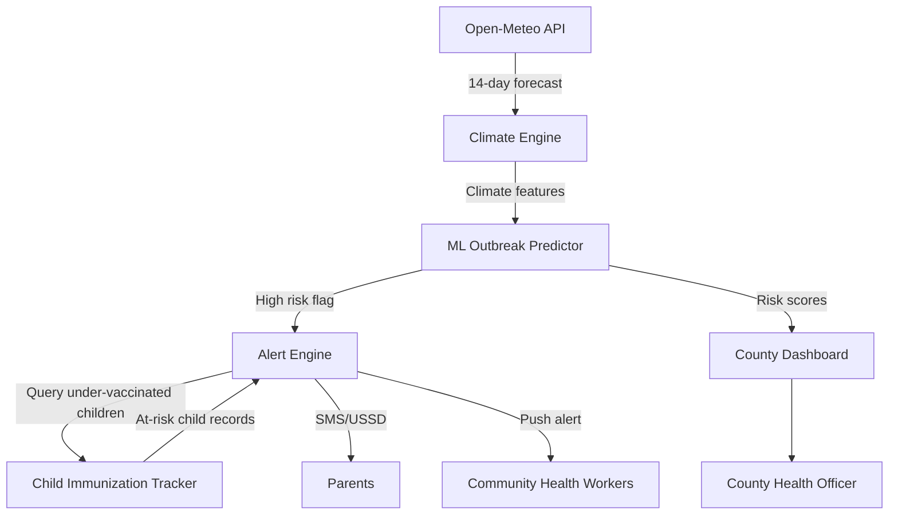

# ClimateShield AI

<div align="center">

**AI-Powered Climate-Responsive Child Immunization Platform**

> Forecasting climate-triggered disease outbreaks 7–14 days ahead.
> Alerting parents of under-vaccinated children before the outbreak peaks.

[](https://www.python.org/)
[](LICENSE)
[]()

</div>

## Table of Content

- [The Problem](#the-problem)
- [The Solution](#the-solution)
- [Architecture](#architecture)
- [Repository Structure](#repository-structure)
- [Current Status](#current-status)
- [Tech Stack](#tech-stack)
- [Getting Started](#getting-started)
- [Components](#components)
- [Related Repositories](#related-repositories)
- [Contributing](#contributing)
- [Built By](#built-by)
- [License](#license)

## The Problem

Climate change is reshaping child disease patterns across East Africa. Flooding triggers cholera. Drought triggers meningitis. Temperature swings trigger pneumonia and malaria. These patterns are predictable — but immunization campaigns run on fixed calendars, not climate triggers.

The result: outbreaks arrive before vaccination coverage is adequate. Children in under-vaccinated communities face the highest risk precisely during climate events that health systems are least prepared for.

## The Solution — 4 Components

| Component | What It Does | Status |
|---|---|---|
| **Climate Engine** | Ingests 14-day weather forecasts for Kenyan counties via Open-Meteo API and scores outbreak risk per disease | Working |
| **ML Predictor** | Forecasts outbreak probability 7–14 days ahead using climate features | In development |
| **Alert Engine** | SMS/USSD reminders to parents of at-risk, under-vaccinated children | Scaffolded |
| **Dashboard** | County health officer outbreak maps and vaccine demand forecast | Wireframes complete |

## Architecture



The Climate Engine is the only fully implemented component today. The rest of the pipeline is actively being developed.

## Repository Structure

```
climateshield-ai/
├── README.md
├── LICENSE                         ← Apache 2.0
├── CONTRIBUTING.md
├── .github/
│   └── ISSUE_TEMPLATE/
│       └── bug_report.md
├── docs/
│   ├── architecture.md             ← Full data-flow documentation
│   └── api-reference.md            ← API reference for all components
├── climate-engine/                 ← WORKING — see below
│   ├── README.md
│   ├── requirements.txt
│   └── ingest.py
├── ml-predictor/                   ← In development
│   ├── README.md
│   ├── requirements.txt
│   └── model_scaffold.py
├── alert-engine/                   ← Scaffolded
│   ├── README.md
│   └── sms_scaffold.py
├── dashboard/                      ← Wireframes complete
│   └── README.md
└── immunization-integration/       ← Integration spec
    └── README.md
```

## Current Status

- [x] Climate data pipeline — fetches 14-day forecasts for 5 Kenyan counties from Open-Meteo API and scores outbreak risk (cholera, malaria, pneumonia, meningitis)
- [x] Child Immunization Tracker prototype — registered child records, vaccination schedules, role-based access
- [x] SMS/USSD alert engine scaffold — English and Swahili message templates
- [x] ML predictor scaffold — GradientBoosting model structure ready for training data
- [ ] ML outbreak prediction model — in training (requires historical outbreak + climate correlation dataset)
- [ ] Open health-data standards integration — in development
- [ ] Full SMS/USSD alert engine — in development (gateway integration pending)
- [ ] County dashboard — wireframes complete, React + Leaflet implementation pending

## Tech Stack

| Layer | Technology |
|---|---|
| Climate data | [Open-Meteo API](https://open-meteo.com/) (free, no key required), Kenya Met Department |
| ML | scikit-learn (GradientBoosting), MediaPipe Tasks (edge/offline inference) |
| Backend | Python (FastAPI planned), PostgreSQL + PostGIS |
| Notifications | SMS/USSD via mobile gateway (Africa's Talking or equivalent) |
| Health data | Child Immunization Tracker (this org), open health-data standards integration planned |
| Dashboard | React.js + Leaflet.js |
| Mobile (CHW) | Android / Kotlin — on-device ML (same architecture as KSL Translator) |

## Getting Started

### Climate Engine (working today)

The climate engine requires only Python 3.x and the `requests` library.

```bash
cd climate-engine
pip install -r requirements.txt
python ingest.py
```

**Example output:**

```json
{
  "county": "Nairobi",
  "risk_scores": {
    "cholera": "LOW",
    "malaria": "LOW",
    "pneumonia": "LOW",
    "meningitis": "LOW"
  },
  "scored_at": "2026-05-14T09:00:00"
}
```

The engine currently covers 5 counties: **Nairobi, Kisumu, Mombasa, Nakuru, Eldoret**.

### ML Predictor (scaffold)

```bash
cd ml-predictor
pip install -r requirements.txt
# Training data required — see ml-predictor/README.md
```

## Components

### Climate Engine (`climate-engine/ingest.py`)

Connects to the [Open-Meteo API](https://open-meteo.com/) — free, no API key required — and pulls 14-day weather forecasts (precipitation, max/min temperature, humidity) for each county. Applies threshold-based risk scoring:

| Disease | Trigger |
|---|---|
| Cholera | Max 14-day rainfall ≥ 50 mm |
| Malaria | Max 14-day rainfall ≥ 30 mm |
| Pneumonia | Average max temperature ≤ 18°C |
| Meningitis | Average max temperature ≥ 38°C |

The ML predictor will replace these thresholds with probabilistic outbreak forecasts trained on historical data.

### ML Predictor (`ml-predictor/model_scaffold.py`)

Scaffold for a `GradientBoostingClassifier` (scikit-learn) trained on 14-day climate features. Input features: `precipitation_sum_14d`, `temp_max_avg_14d`, `temp_min_avg_14d`, `humidity_max_avg_14d`. Output: outbreak probability (0–1) and risk level (HIGH / MEDIUM / LOW).

### Alert Engine (`alert-engine/sms_scaffold.py`)

SMS delivery scaffold with message templates in English and Swahili. Integrates with any REST-based mobile gateway. Message content includes the disease, risk level, county, child name, and vaccine due.

### Immunization Integration (`immunization-integration/`)

Specification for how the Alert Engine queries the Child Immunization Tracker to identify under-vaccinated children in high-risk counties. Planned integration with open health-data standards for MOH system interoperability.

### County Dashboard (`dashboard/`)

Planned React.js + Leaflet.js interface for county health officers showing real-time outbreak risk heatmaps, vaccine demand forecasts, and alert history.

## Related Repositories

| Repository | Role in ClimateShield AI |
|---|---|
| [Child Immunization Tracker](https://github.com/jarida-io/Child-Immunization-Tracker) | Data source: child records, vaccination status, guardian contact details |
| [KSL Translator](https://github.com/jarida-io/kenyan_sign_language_app) | Demonstrates Jarida's on-device ML capability — the same MediaPipe Tasks architecture will power the offline CHW module |

## Contributing

See [CONTRIBUTING.md](CONTRIBUTING.md). Priority areas:

- **Training data**: Historical climate + disease outbreak correlation data for Kenyan counties
- **ML model**: Improve the outbreak prediction model in `ml-predictor/`
- **Gateway integration**: Connect a live SMS/USSD gateway to `alert-engine/`
- **Dashboard**: React + Leaflet county heatmap implementation
- **Swahili content**: SMS template translations and review

## Built By

**Jarida Open Source** — a youth-led technology startup from Nairobi, Kenya, building open-source tools for public health and inclusive communication.

[jarida.io](https://jarida.io) | [github.com/jarida-io](https://github.com/jarida-io)

## License

Apache 2.0 — see [LICENSE](LICENSE)

```
Copyright 2024 Jarida Open Source

Licensed under the Apache License, Version 2.0 (the "License");
you may not use this file except in compliance with the License.
You may obtain a copy of the License at

    http://www.apache.org/licenses/LICENSE-2.0
```
