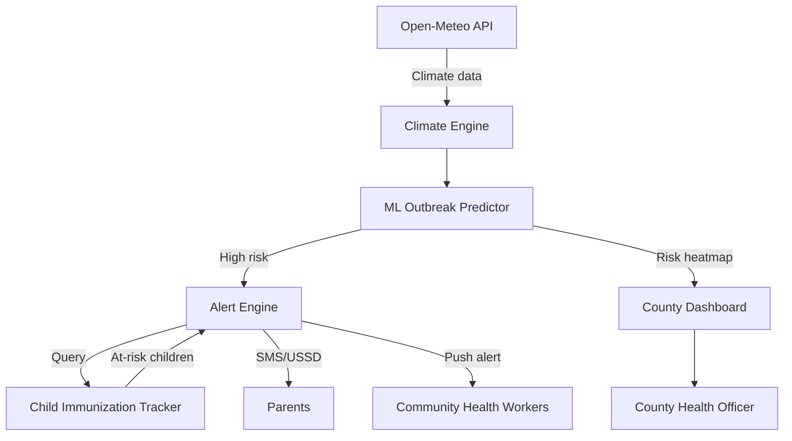

# ClimateShield AI

### AI-Powered Climate-Responsive Child Immunization Platform

> Forecasting climate-triggered disease outbreaks 7–14 days ahead.
> Alerting parents of under-vaccinated children before the outbreak peaks.

---

## The Problem

Climate change is reshaping child disease patterns across East Africa. Flooding triggers cholera. Drought triggers meningitis. Temperature swings trigger pneumonia. These patterns are predictable — but immunization campaigns run on fixed calendars, not climate triggers.

## The Solution — 4 Components

| Component | What It Does |
|---|---|
| Climate Engine | Ingests real-time weather data per sub-county |
| ML Predictor | Forecasts outbreak probability 7–14 days ahead |
| Alert Engine | SMS/USSD reminders to parents of at-risk children |
| Dashboard | County health officer outbreak maps & vaccine demand |

## Architecture

## Current Status

- [x] Climate data pipeline (5 Kenyan counties)
- [x] Child Immunization Tracker prototype
- [ ] ML outbreak prediction model — in training
- [ ] Open health-data standards integration — in development
- [ ] SMS/USSD alert engine — in development
- [ ] County dashboard — wireframes complete

## Tech Stack

- ML: scikit-learn, TensorFlow Lite
- Backend: Python (FastAPI), PostgreSQL + PostGIS
- Climate: Open-Meteo API, Kenya Met Department
- Notifications: SMS/USSD via mobile gateway
- Health data: open health-data standards integration
- Frontend: React.js + Leaflet.js | Mobile: Android/Kotlin

## Built By

Jarida Open Source — a youth-led startup from Nairobi, Kenya.
jarida.io | github.com/jarida-io

## License

Apache 2.0 — see LICENSE
