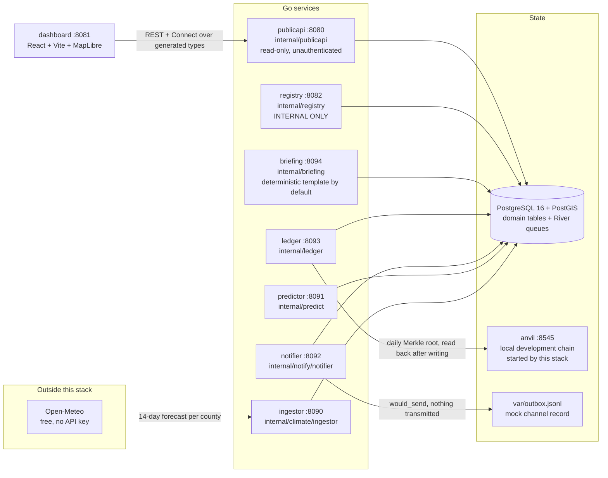
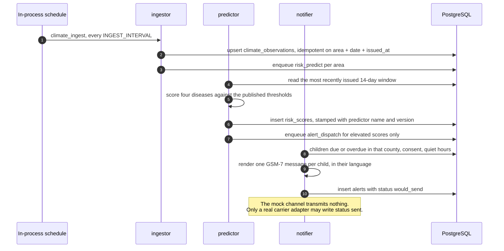
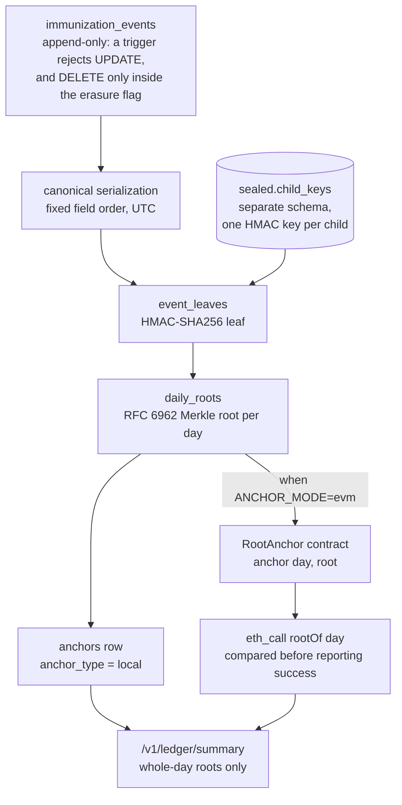
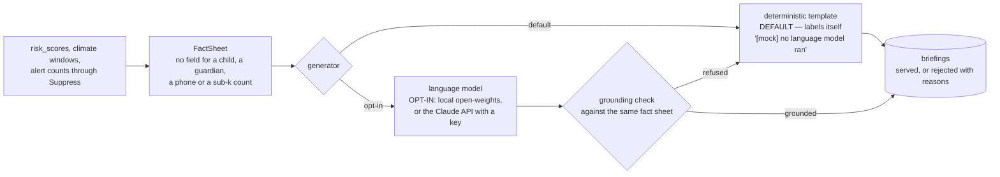
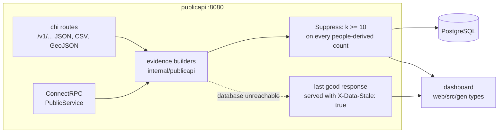

# Architecture

What the code in this repository actually does, drawn from the code. Every box
below exists as a Go package or a container in `docker-compose.yml`; every
arrow is a call or a job that is made somewhere in `internal/` or `cmd/`.

Nothing here describes a plan. Where a path stops short of the real world — the
messaging channel, the chain the ledger anchors to — the diagram says so, in
the diagram.

Superseded prototype diagrams live in
[`reference/prototype-docs/`](../reference/prototype-docs/README.md); they
describe a different system and several claims in them were never
substantiated.

## Services

Seven long-running services plus three one-shot commands, all from one Go
module. Each service's `cmd/*/main.go` is about fifteen lines and delegates to
`Run` in its package.

`registry` is not published by the production compose overlay: it is the only
service that touches child and guardian records, and it is reachable inside the
compose network only.

## The pipeline

River jobs, one queue per working service, so a service never fetches a job
kind it has no worker for. Each service runs its own in-process schedule
(`internal/jobs/schedule.go`) because River elects one leader per database, and
a shared leader silently starved every other service's periodic work.

The scoring step is deterministic and the thresholds are contractual: they live
in `internal/predict/rules.go` and nowhere else. Two of the four published
cutoffs cannot be reached in the monitored counties — that finding is recorded
in [`threshold-validation.md`](threshold-validation.md), served on `/v1/model`,
and deliberately not "fixed" in code.

## The immunization record

Doses recorded through the registry become leaves; each day's leaves fold into
one Merkle root; the root is anchored. Individual leaves are never published:
a leaf is a per-child HMAC, and publishing one would put a per-child artifact
on a public surface.

Two properties are worth stating plainly because they are easy to overclaim:

- The chain in `docker-compose.yml` is a **local development chain started by
  this stack**. Its history does not outlive `make down -v`. Nothing here is
  written to any public network, and no surface in this repository calls it
  public, immutable or decentralised.
- **Erasure still works.** `ForgetChild` deletes the records, scrubs the leaf
  linkage and destroys that child's HMAC key, which makes their leaves
  permanently unlinkable while previously published roots continue to verify.

## The county briefings

The briefing service builds an aggregate **fact sheet** for a county — the same
numbers the public API already publishes, through the same k>=10 suppression —
and turns it into prose. Nothing generates on a request path: the service runs
its own sweep on `BRIEFING_SWEEP_INTERVAL`, and a county whose fact-sheet hash
has not changed regenerates nothing.

A draft is refused for a number not traceable to the fact sheet, another
county, an unscored disease, a disease at the wrong tier, an accuracy or
outbreak-prediction claim, an "SMS sent" claim in either language, a person- or
phone-shaped string, or a model writing the `[mock]` label itself. Refused text
is never served, stored or logged — only the kinds of violation are published,
because repeating the text would repeat exactly what the check exists to stop.

No generated text ever reaches a guardian. Alert SMS comes only from the fixed,
length-checked templates in `internal/notify`.

## The public surface

One read-only tier serves both REST and Connect from the same protobuf
messages, and the dashboard's TypeScript types are generated from that same
schema — there are no hand-written response interfaces.

Reads never return 500: a failing database serves the last good response,
marked stale, and the dashboard says so under the nav rather than presenting
cached figures as current. Two contract tests guard the surface and are run by
name in CI — `TestContract_PIILeak` walks it looking for anything child-shaped,
and `TestContract_KAnonymity` fails the build if a count below ten ever
reaches a public response, in JSON or in the CSV export.

## Storage

| Table | What it holds |
|---|---|
| `areas` | The five monitored counties, with centroids. Sub-county level is schema-only. |
| `climate_observations` | Ingested forecast windows, keyed by area, forecast date and issue time. |
| `risk_scores` | One row per area, disease and forecast date, stamped with the predictor that produced it. |
| `children`, `guardians`, `consent_log` | Registry records. PII encrypted at rest; consent is append-only and the most recent entry decides. |
| `vaccine_schedule` | The seeded KEPI doses and their due ages. |
| `immunization_events` | Doses given. Append-only, enforced by a database trigger. |
| `event_leaves`, `daily_roots`, `anchors`, `anchor_contracts` | The ledger: per-child HMAC leaves, daily Merkle roots, anchor receipts and the deployed contract per chain. |
| `sealed.child_keys` | Per-child HMAC keys, in their own schema. Referenced from exactly one query file. |
| `alerts` | What the alert path did for each child and score, including the outcomes that were skipped and why. |
| `briefings` | One county briefing per language, with the generator, model and prompt version that wrote it, the fact sheet it was written from and that sheet's hash. A refused draft is recorded with status `rejected` and its reasons — the body stored is the labelled template, and the model's own text is never stored. |
| River tables | Durable job queues with real retry history. |

## What runs where

`make up` starts Postgres, runs migrations, then the seven services, the local
development chain and the dashboard. `make demo` drives one pass of the whole
pipeline against committed fixtures and prints what it did. Both need zero
credentials, and every dependency is open source and free.
